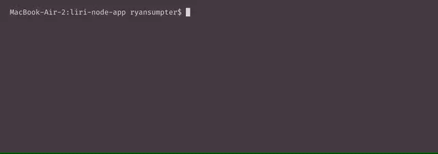

## What is LIRI?

LIRI is like iPhone's SIRI. However, while SIRI is a Speech Interpretation and Recognition Interface, LIRI is a Language Interpretation and Recognition Interface. LIRI will be a command line node app that takes in parameters and gives you back data.

## What can LIRI Do?

LIRI provides three primary functions:
  * Tell you about upcoming concerts for a particular band or artist
  * Provide information about a particular song
  * Provide information about a particular movie

## Interecting with LIRI

To begin interacting with LIRI, you will need the following Node packages: 
  * Axios
  * Moment
  * DotEnv
  * Node-Spotify-API

```
npm install -y
```
```
npm install axios
```
```
npm install moment
```
```
npm install dotenv
```
```
npm install node-spotify-api
```

Once our packages are installed, we are ready to start interacting with LIRI!

## LIRI In Action

Run the following to use LIRI's concert search function:
```
node liri.js spotify-this-song "<artist/band name goes here>"
```


Run the following to use LIRI's song search function:
```
node liri.js spotify-this-song "<song name goes here>"
```


Run the following to use LIRI's movie search function:
```
node liri.js movie-this "<movie name goes here>"
```

